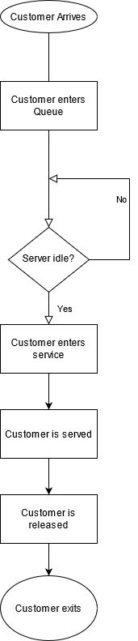

# Queues
---
## I.  Introduction
So what are queues anyways?  Queues are what are considered "First in, first out", meaning the process of removing an object from the queue will remove it in the order it was queued in to begin with.  Think like a conveyor belt.  This is different from a stack, where like a stack of pancakes, it is much harder to slip a pancake from a stack, so it is "Last In, First Out".

Queues are used when we need to process a collection of requests in an orderly way.

## II. Push/Pop or Enqueue/Dequeue
You may be familiar with these terms if you're already aware of the stack as a concept as explained earlier.  However, the commands for queues differ, and are called enqueue() (for adding), and dequeue() (for removing).  Dequeue can actually "pop" as well, as long as you are taking from the index 0.

## III. Functions/Operations on Queues
As mentioned, enqueue and dequeue are the most common operations to use on a queue.  However, there are others.  Size() can ascertain the size of a queue, and empty() can determine if the queue is empty.

Additionally, there are more advanced forms of container classes resembling queues. There are deques, which work off of both sides, and have functions like extendleft(), extend, popleft(), pop(), etc.  Conceptually, adding or removing the element on the left of a deque is behavior associated with a queue.
## IV. Queues in Flowcharts/Program Planning
Consider an IT service queue, in the simplest terms.  When a customer enters the system, it looks something like this:


Here, we see how customers go in line first, and leave the queue out first as well.

## V. Example
Considering the queue above, the implementation of the queue in Python would look something like this:
```Python
customer_Queue = queue()
#Time to Enqueue
cust_num = int(input("How many customers are in the system?"))
for i in range(2, cust_num+1):
    customer_Queue.append(i)
    i= i+1


serviced = False
serviced = bool(input("Was the customer served?"))

if serviced == ("True"):
    #Dequeuing in action
    for i in range(2, 0)
        del customer_Queue(i)
        i = i-1
return;
```

## VI. Problems
1. Create a queue of numbers from 1-10, enqueueing all numbers.  Dequeue it twice, then enqueue it once.  Dequeue it three times.  What number do you have as the output if you tell it to print the result?

2. Create a queue of a class "Golfer", that keeps track of names and scores.  It could look like this:
```Python
class Golfer:
    def __init__(self, name, score):
        self.name = name
        self.score= score

    def __str__(self):
        return "%-16s: %d" % (self.name, self.score)
```
How would the queue look like if you were to add Tiger Woods, Phil Mickelson, and Hal Sutton?  How would you manipulate a queue to prioritize position in queue by score?

Here is the [Solution](Sol1.md)
