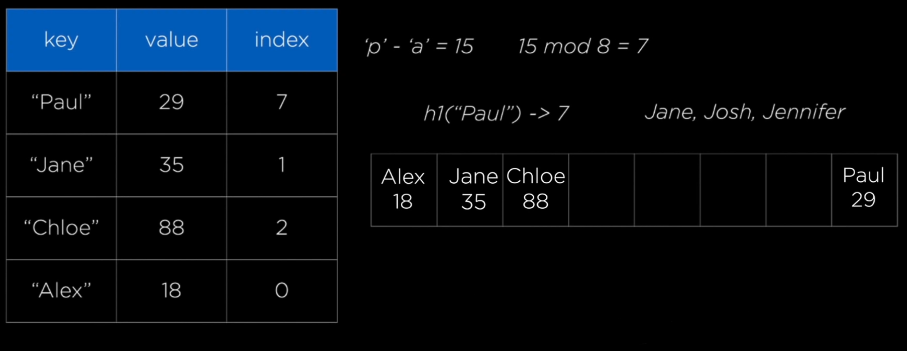
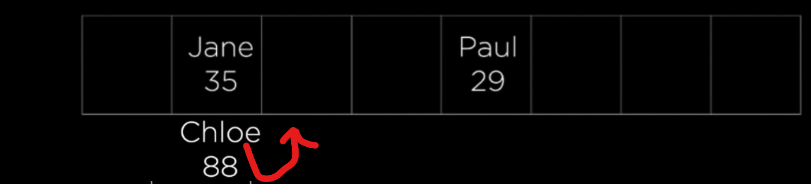
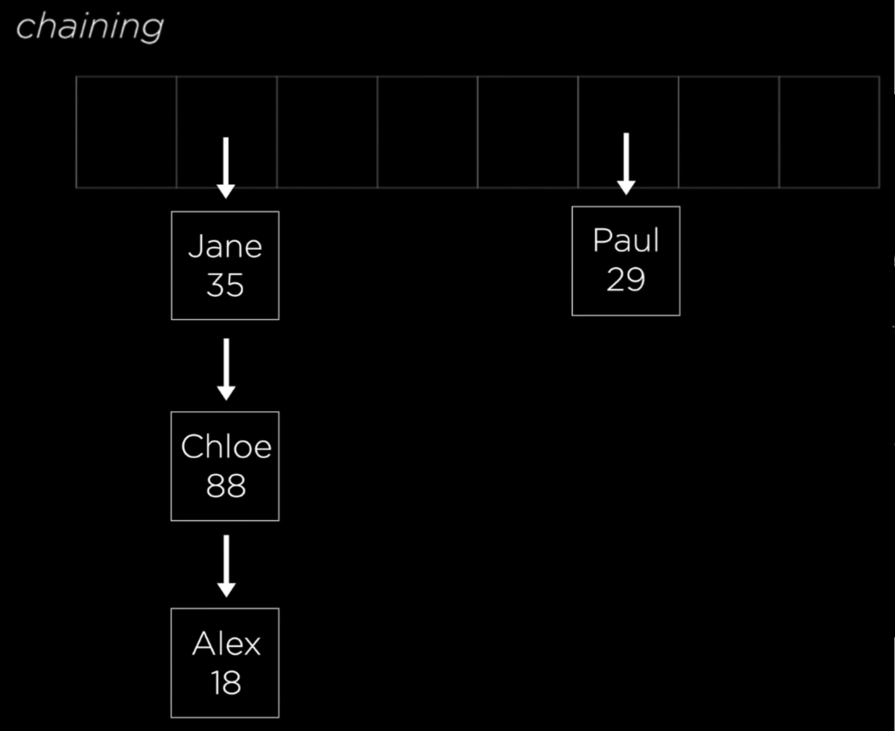

# Sets
---
## I.  Introduction
Sets are a data structure where order of the data doesn't matter.  Where most data structures are concerned with position, sets contain a cluster of data, and all values are unique.  Because of these two rules, the time complexity surrounding a set in general is very efficient.  Additionally, a set will automatically filter out duplicate values without producing an error.

For an analogy, imagine a group of kids with a bag of marbles, some are the same pattern.  Each kid wants to expand their marble collection, and they all agree to divy it up as evenly as possible.  Since it's a collection, they don't want to have duplicates.  The values can be seen as the marbles in this analogy, and the collections of each respective child could be seen as a set.


## II. Hashing
Because there is little regard for order or determining duplicates (as they won't be accepted), Sets are more concerned with whether the data belongs to a given set.  All of the techniques to add, remove, or test for membership in a set is part of a process called hashing, and these operations all have a time complexity of O(1) time!

In order to get values of any size to be worked with in a set at O(1) performance, the formula index(n) = hash(n) % sparse_list_size is used.  Hash(n) is our hashing function, and will convert non-integers to integers so that modulus division can be performed.  In Python, this is as simple as saying:
```Python
>>> hash(10)
10
```
Now for a bigger set:
```
List = [11, 12, 13, 14, 15]
H(x) = [x % 10]
```
| Value | hash(n) % sparse_list_size | Index/Key(n)|
| :---: | :------------------------: | :-------:   |
|  11   |          11 % 10           |      1      |
|  12   |          12 % 10           |      2      |
|  13   |          13 % 10           |      3      |
|  14   |          14 % 10           |      4      |
|  15   |          15 % 10           |      5      |

In case you are wondering, you can also do this to other types of values like strings, you can!  Hashing a set of strings efficiently is done by adding the ASCII values of each character in the string, then modulo by array size to find its index.



There is a problem with sparse lists though.  If we are fed tons of unique values, they could have overlapping indexes based on this formula.  For example, if we were to add 21 to our set of numbers above, it would also have an index of 1.  This is called a collision or conflict.  There are several strategies in dealing with this without expanding our list size:

- Open Adressing: If we use our index(n) hashing function and find the space is occupied by another value, we can simply move to the next available space.  The simplest way to do this is to move along to the right each time by one spot until an index space is empty. 



This can still cause conflicts over time, as spots get filled more and more which will create more collisions for future values that are supposed to go to those indexes.


- Chaining: Instead of moving to a new index, make a list of values within the same index.  So in our example, 11 and 21 would both be in a list under the index 1.  It would look like this with our strings example:




The downside to all this of course is our time complexity suffers.  Searching through several positions to find a value that was supposed to be in its original index, or going through a chained list more and more brings us to O(n) time.  To solve this, we need to increase the size of the sparsed list, which if done requires us to run the values through our ```index(n) = hash(n) % sparse_list_size``` formula with the new list size.

Remember, even though values are organized into a hashset, they won't be kept in order.

## III. Functions/Operations in Sets and use in Python

These operations are the ones that can be done with set implimentation in Python.  Below is a table containing operations as well as the the purpose of each:

| Operation     | Purpose                      |
| :-----:       | :----------------------:     |
| add(value)    | Adds a value to the set      |
| remove(value) | Removes a value from the set |
| member(value) | Determines if the value is in the set |
| size()        | Returns the number of items in the set|

We can additionally use mathematical operations on sets:
| Operation | Purpose                      |
| :-----------------------: | :----------------------:     |
| intersection(set1, set2) | Determines common values in both sets      |
| union(set1, set2) | Combines both sets values together |
| member(value) | Determines if the value is in the set |
| size()        | Returns the number of items in the set|


Unions can also be written using the | or union() operator:
```Python 
# These are both the same:
set3 = set1.union(set2)
set3 = set1 | set2
```
and intersections can be written with the & operator or intersection() operator:
```Python
set3 = set1.intersection(set2)
set3 = set1 & set2
```
The ```in``` operator to find membership in the set.

Here is the syntax for them:
add: ```set1.add(value)```
remove: ```set1.remove(value)```
member: ```if value in set1```
size() ```length = len(set1)```

Remember, the performance of the set is based on the hashing algorithm's time complexity.  If conflict resolution is consistent and good strategy is used in hashing a set, performance should be O(1)

## IV. Sets in Python

In Python, a set is represented within curly braces:

```Python
set_1 = {1, 2, 3}
```

And to create a new one, we use:
```Python
empty_set = set()
```


## V. Example
Here is an example of a program that creates some sets, and performs the add, intersect, union, and in operations:

```Python
#Start up our sets
set1 = {'c', 'o', 'd', 'e'}
set2 = {'m', 'o', 'n', 'k', 'e', 'y', 's'}
#Add
set1.add('s')
print('Letters after adding: ', set1)

#Union
set3 = set1.union(set2)
print('Letters after union: ', set3)
#Intersect
set4 = set1.intersection(set2)
print('Letters after intersection: ', set4)

#indicates which values are in all sets
x = 's'
#Create a Counter
i = 0
for x in set1 & set2 & set3 & set4:
    i +=1
print('This is how many times', x, ' appeared in all sets: ')

print(i)
```

## VI. Problem
1. Using what you learned in sets, create two sets, then  remove the items that are not present in both sets:

2. Calculate hashing for the following to create a hash table, assuming a table of size 16. Use chaining for collision/conflict avoidance:
{12, 13, 25, 42, 200, 57, 24, 46, 75, 1, 9, 450, 221, 58, 24, 33, 27, 58, 65, 2, 14, 54}


Here is the [Solution](Sol3.py)

[Back to Home](Python_Structures_Tutorial.md)


