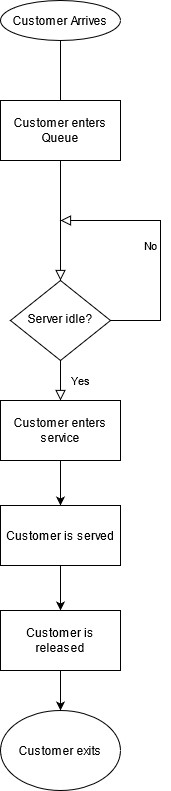

# Binary Trees
---
## I.  Introduction
Let's get to know what a tree is conceptually.  Trees are a data structure where nodes are connected to each other via pointers.  These trees interconnect nodes in multiple places, and some of them have names.  The starting node of a tree is always called the root, a node with pointers going further down is called a parent node, and the nodes connecting to a parent from below are called child nodes.  Binary Trees are among the most common type of trees, and these will be the focus of this lesson.
Here is an image for reference:


## II. Types of Binary Search Trees


|   Order   |      Enqueue/Dequeue position      |
| :-----:   | :------------:                     |
| 1         |1             |1                    |
| 2         |2             |2                    |
| 3         |3             |3                    |
| 4         |4             |4                    |

## III. Functions/Operations on Queues
As mentioned, enqueue and dequeue are the most common operations to use on a queue.  However, there are others.  Size() can ascertain the size of a queue, and empty() can determine if the queue is empty.

Additionally, there are more advanced forms of container classes resembling queues. There are deques, which work off of both sides, and have functions like extendleft(), extend, popleft(), pop(), etc.  Conceptually, adding or removing the element on the left of a deque is behavior associated with a queue.

All of these basic operations/algorithms within the queue have time complexities that are straightforward.  Assuming worst case, the complexity is:
| Operation     | Performance   |
| :-----:       | :------------:|
| enqueue(value)| O(1) |
| dequeue()     | O(n) |
| size()        | O(1) |
| empty()       | O(1) |


## IV. Queues in Flowcharts/Program Planning
Consider an IT service queue, in the simplest terms.  When a customer enters the system, it looks something like this:





Here, we see how customers go in line first, and leave the queue out first as well.

## V. Example
Considering the queue above, the implementation of the queue in Python would look something like this:
```Python
customer_Queue = queue()
#Time to Enqueue
cust_num = int(input("How many customers are in the system?"))
for i in range(2, cust_num+1):
    customer_Queue.append(i)
    i= i+1


serviced = False
serviced = bool(input("Was the customer served?"))

if serviced == ("True"):
    #Dequeuing in action
    for i in range(2, 0)
        del customer_Queue(i)
        i = i-1
return
```

## VI. Testing Example
1. Create a queue of numbers from 1-10, enqueueing all numbers.  Dequeue it twice, then enqueue it once.  Dequeue it three times.  What number do you have as the output if you tell it to print the result?

So looking at it, it should look like so:
```Python
class Queue:
	def __init__(self, capacity):
		self.front = self.size = 0
		self.rear = capacity -1
		self.Q = [None]*capacity
		self.capacity = 10
	
	def isEmpty(self):
		return self.size == 0

	# Function to add an item to the queue.
	def EnQueue(self, item):
		if self.isFull():
			print("Full")
			return
		self.rear = (self.rear + 1) % (self.capacity)
		self.Q[self.rear] = item
		self.size = self.size + 1
		print("% s enqueued to queue" % str(item))

	# Function to remove an item from queue.
	def DeQueue(self):
		if self.isEmpty():
			print("Empty")
			return
		
		print("% s dequeued from queue" % str(self.Q[self.front]))
		self.front = (self.front + 1) % (self.capacity)
		self.size = self.size -1

#Test/Driver
queue = Queue(10)
queue.DeQueue()
queue.DeQueue()
queue.EnQueue()
queue.DeQueue()
queue.DeQueue()
queue.DeQueue()

```

## VII Priority Queue
You may have seen the concept of a queue, and wondered "is there a way to organize it by a particular order instead of the order served/put in?" A priority queue works similarly to a queue, except it does the following:
1. An element assigned with a higher priority will be entered in the queue first, even if it further down in service
2. If elements have equal priority, it defaults to queue behavior and orders by the one that came sooner.

The time complexity for this is O(n log n) for insertion usually, and O(1) for pulling.  There are more efficient forms, but we'll use this one to start.

## VIII Advanced Problem