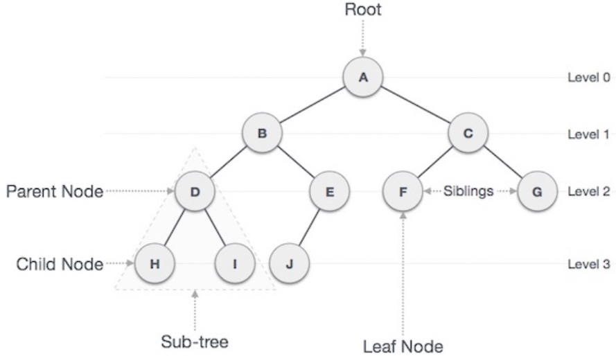
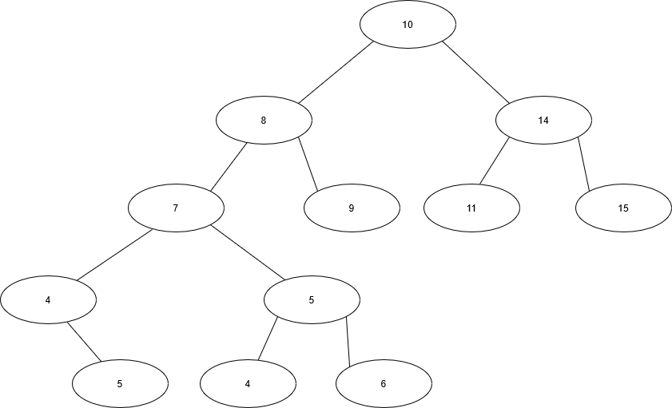

# Binary Trees
---
## I.  Introduction
Let's get to know what a tree is conceptually.  Trees are a non-linear data structure where nodes are connected to each other via pointers.  These trees interconnect nodes in multiple places, and some of them have names.  The starting node of a tree is always called the root, a node with pointers going further down is called a parent node, and the nodes connecting to a parent from below are called child nodes. Subtrees are portions of the tree that are formed from the left and right of a parent node, and leaves are the bottom nodes that don't connect to any others.  Binary Trees are among the most common type of trees, and these will be the focus of this lesson.
Here is an image for reference:



## II. Types of Binary Trees
Binary Trees are trees that only have two nodes from the each parent node.  If we made a Node class In Python, this is what the blueprint for each node in the tree would be:

```Python
class BST:
    # Nodes are a part of BSTs, so they should be part of the larger class
    class Node:
        def __init__(self,key):
            self.left = None
            self.right = None
            self.val = key
```

A Binary Search Tree (or BST for short) has a hierarchy or set of rules in how its subtrees are ordered.  The right subtree of a node has a key that's greater than its parent node, while the left subtree will have a key that's lesser than its parent node's key.  They also can't have duplicate keys.  Below is an example of one based on simple values:


---
A Balanced Binary Search Tree is a tree that has been organized with the lowest possible amount of levels possible.

An example of an unbalanced BST:
```
         8
        /
      6
     / \
    5   7
   /
  4
 /
3
```
Converted to a balanced BST:
```
     5
    / \
   4   7
  /   / \
 3   6   8
```
<<<<<<< HEAD

=======
>>>>>>> bba4239a666c21f7bc524877be8d2f42285bcc57
When we balance a BST, we are aiming to get to a time complexity of O(log n).  An unbalanced BST more closely resembles a dynamic array or linked list, and has to wade through more nodes to adjust values via insertion or search, resulting in a O(n) time complexity.

## III. Functions/Operations on Binary Search Trees
Speaking of adjustment, there are operations we can perform on BST.  Insertion into a BST follows an iterative level traversal sequence of a tree we create using a queue (does that sound familiar?) If there is a node who has a missing child, and the value meets the rules for the left/right child node placement, the new key is made in the child, and it moves down until a node is found whose left or right are missing.

There are other operations, some similar to other data structures you've learned before (with respective time complexities):

| Operation     | Performance   |
| :-----:       | :------------:|
| insert(value)| O(log n) |
| remove(value)| O(log n) |
| contains(value)| O(log n) |
| traverse_forward | O(log n) |
| traverse_reverse | O(log n) |
| height(node)    | O(log n) |
| size()    | O(1) |
| empty()    | O(1) |


The insert function is what's used to insert a value into the tree.  It recursively calls `_insert` beginning at the root.  If the root is empty, the node is made into the root.  The `insert` function looks like so, in Python (and assuming our Node Class):
```Python
def insert(self, data):
	if self.root is None:
        # Make the new root
		self.root = BST.Node(data)
	else:
        # Call recursively to start at the root
		self._insert(data, self.root)

def _insert(self, data, node):
    if data < node.data:
		# Move to the left
		if node.left is None:
			# empty spot
			node.left = BST.Node(data)
		else:
			# If the value belongs in the left but still hasn't found an empty node, keep going
            # Calls itself recursively to keep going left
			self._insert(data, node.left)
	elif data >= node.data:
		# Move to the right
		if node.right is None:
			# empty spot
			node.right = BST.Node(data)
		else:
			# If the value belongs in the right but still hasn't found an empty node, keep going
            # Calls itself recursively to keep going right
			self._insert(data, node.right)
```

Some of the less familiar operations do the following:
- `contains(value)` ascertains if the value is in the tree.
- `height(node)` is handy for finding the maximum height.  Recursively calls itself hence the time complexity of O(log n)
- `size()` returns the size innately stored in the BST
- `empty()` as you saw helps us with traversal, searching, etc. The value is static so no linear complexity.

## IV. Traversal
Traversal is another function.  This is how we present data in the tree.  The best method is again to use recursion.  You can either do a forward or reverse traversal in Python.  The starting function is called `__iter__`.  When we use a for loop on each item in the tree, `__iter__` will find the next value in the BST.  yield is a command that feeds the next value into the aforementioned loop.  We use yield because it allows us to go back to the previous position in the tree.  We can use `yield from` if we want to call the event from another function.  The `__reversed__` function is used for a reverse traversal.  The syntax in Python is as follows:
```Python
def __iter__(self):
    # yield will then be done by _traverse_forward, starting at root
    yield from self._traverse_forward(self.root)

def _traverse_forward(self, node):
    # Condition is if node has a value
	if node is not None:
        # Scours the tree on both sides, recursively calling itself until the if statement can't be met
		yield from self._traverse_forward(node.left)
		yield node.data
		yield from self._traverse_forward(node.right)

```

You will often need __reversed__ to help with formward traversal.  Here is what that looks like:
```Python
    def __reversed__(self):
        """
        Perform a formward traversal (in order traversal) starting from
        the root of the BST.  This function is called when a the
        reversed function is called
        """
        yield from self._traverse_backward(self.root)
```


## V. Example
Here is an example of a program that creates a tree, then inserts into the tree, and prints it in order:
```Python
class BST:
    # Nodes are a part of BSTs, so they should be part of the larger class
    class Node:
        def __init__(self,key):
            self.left = None
            self.right = None
            self.val = key

    def insert(self, data):
	if self.root is None:
        # Make the new root
		self.root = BST.Node(data)
	else:
        # Call recursively to start at the root
		self._insert(data, self.root)

    def __init__(self):
        self.root = None

    def _insert(self, data, node):
        if data < node.data:
            # Move to the left
            if node.left is None:
                # empty spot
                node.left = BST.Node(data)
            else:
                # If the value belongs in the left but still hasn't found an empty node, keep going
                # Calls itself recursively to keep going left
                self._insert(data, node.left)
        elif data >= node.data:
            # Move to the right
            if node.right is None:
                # empty spot
                node.right = BST.Node(data)
            else:
                # If the value belongs in the right but still hasn't found an empty node, keep going
                # Calls itself recursively to keep going right
                self._insert(data, node.right)
val1 = input("What is the first item you want to insert?" )
val2 = input("What is the second item you want to insert?" )
val3 = input("What is the third item you want to insert?" )
val4 = input("What is the fourth item you want to insert?" )
val5 = input("What is the fifth item you want to insert?" )

tree = BST()
tree.insert(val1)
tree.insert(val2)
tree.insert(val3)
tree.insert(val4)
tree.insert(val5)
for x in tree:
    print(x)

```

## VI. Problem
Now try to create the contains() and traverse_backwards functions for this tree.  You can use the preexisting code but add the functions in.
You will want to start with having __iter__ and __reversed__ functions too.  You will also need forward_traverse.


Here is the [Solution](Sol2.py)

[Back to Home](Python_Structures_Tutorial.md)


